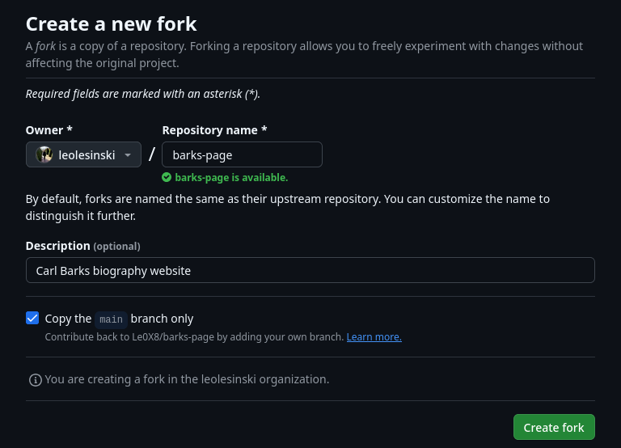
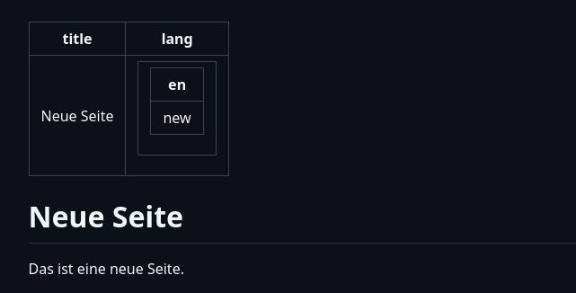
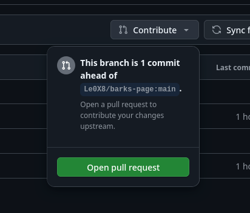

# Zur BarksPage beitragen

Vielen Dank, dass du mithelfen möchtest! Um bei diesem Projekt beizutragen, folge bitte den folgenden Schritten.

## 1. GitHub-Konto erstellen

Zuerst musst du dir ein GitHub-Konto anlegen. Das ist kostenlos und dauert nur ein paar Minuten.

&rarr; <https://github.com/signup>

## 2. Fork erstellen

Forke die Repository, indem du auf [diesen Link](https://github.com/Le0X8/barks-page/fork) klickst und "Create fork" drückst.

Das erstellt eine 1:1-Kopie der Webseite, in der du Änderungen durchführen kannst.



Solltest du schon einen Fork erstellt haben, drücke bei deiner eigenen Kopie einfach "Sync fork" und bringe deine Kopie auf den neuesten Stand.

## 3. Führe Änderungen durch

### 3.1. Webseiten bearbeiten und erstellen

Gehe in den `src/pages`-Ordner. Dort findest du wiederum zwei Ordner, `de` und `en`. Gehe in den Ordner, in dem du eie Webseite erstellen willst und drücke dann "Add file" - "Create new file".

Trage bei "Name your file..." den gewünschten Pfad ein, Slashes sind auch erlaubt. Der Pfad muss auf `.md` enden.

Bei "Enter file contents here...", trägst du den Seiteninhalt ein.

**Beispiel:**

```
---
title: Neue Seite
lang:
  - en: new
---

# Neue Seite

Das ist eine neue Seite.
```

Der Part mit `title` und `lang` sind Hilfen für die Webseite, um den Seitentitel an den Browser weiterzugeben oder den Pfad für die gleiche Webseite in einer anderen Sprache anzugeben.

Um die Vorschau anzuzeigen, klicke auf `Preview`. Das sieht dann ungefähr so aus:



Speichere die Webseite, indem du auf "Commit changes..." drückst. Bei "Commit message" dann bitte eintragen, welche Änderungen durchgeführt wurden. Wähle "Commit directly to the main branch" und drücke dann "Commit changes".

## 4. Einen Pull Request öffnen

Wenn du alle Änderungen, die du machen wolltest abgeschlossen hast, kannst du einen Beitragsantrag stellen. Drücke hierzu auf "Contribute", dann auf "Open pull request":



Du kannst im Antrag einen Titel und eine Beschreibung deiner Änderungen setzen. Wenn du wirklich fertig bist, klicke auf "Create pull request".

Sollte alles passen, wird die Änderung auf der Webseite übernommen. Wenn nicht, wird dazu eine Begründung und/oder Verbesserungsvorschläge abgegeben.